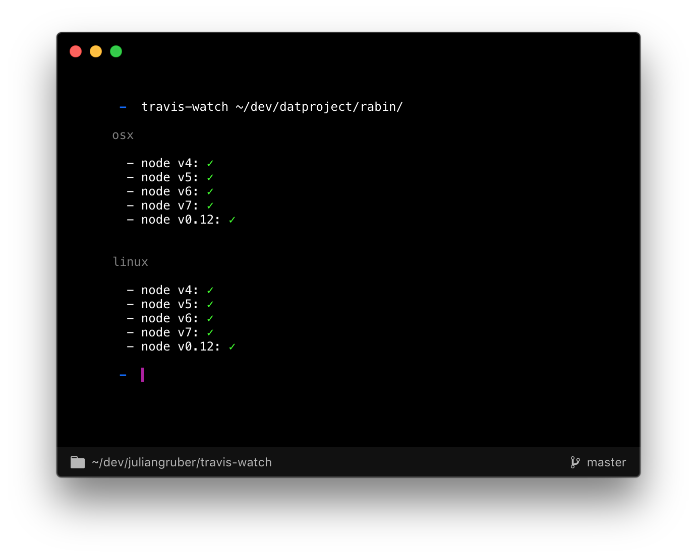

# travis-watch [](https://travis-ci.org/juliangruber/travis-watch) [](https://greenkeeper.io/)

Stream live travis test results of the current commit to your terminal. Exits with the proper exit code too!



## Installation

```bash
$ npm install -g travis-watch
```

## Usage

```bash
$ travis-watch --help
Usage: travis-watch [DIRECTORY]
```

## Supported build environments

- Node.js
- Ruby
- PHP
- Go
- Python

For more, please [open an issue](https://github.com/juliangruber/travis-watch/issues/new).

## Kudos

- Development of this module is sponsored by the [Dat Project](https://datproject.org/).
- __[ansi-diff-stream](https://github.com/mafintosh/ansi-diff-stream)__ makes for flicker free terminal rendering
- Spinners through __[cli-spinners](https://github.com/sindresorhus/cli-spinners)__
- Travis is :heart:

## License

MIT
